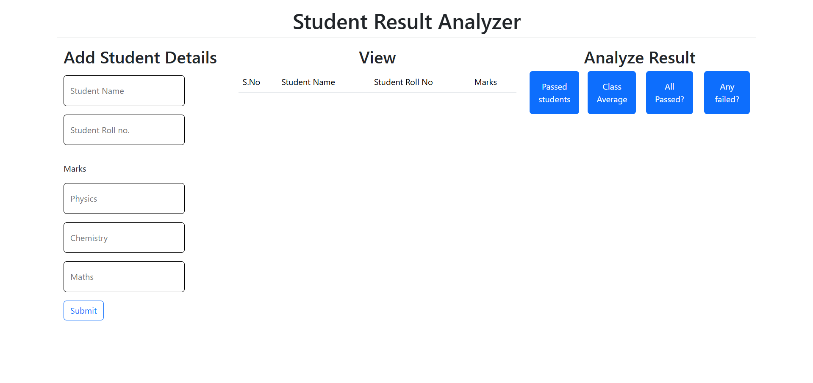
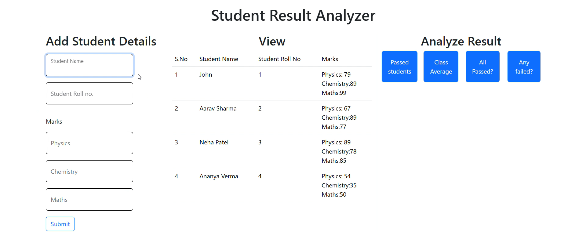
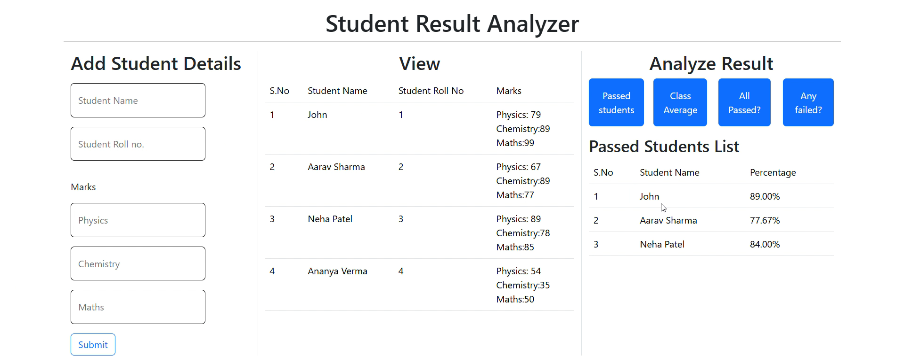

🎓 Student Result Analyzer

A simple and logical JavaScript project that analyzes student results using modern array methods.

This project demonstrates the practical use of:

- map()
- filter()
- reduce()
- every()
- some()

Built using HTML, CSS, Bootstrap 5, and JavaScript.

🚀 Features

- ✅ Display all students in a table
- ✅ Show only passed students
- ✅ Calculate class average
- ✅ Check if everyone passed
- ✅ Check if anyone failed

🚀 Live Demo:

https://github.com/user-attachments/assets/8cc69043-2f28-48bd-b906-d9357946651c

Preview Screenshots:

1. Output
   

2. Table view after adding student details
   

3. Passed student list
   
