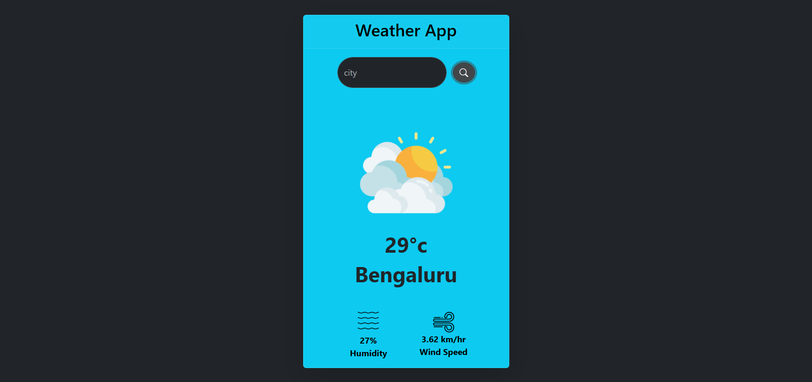

Weather App in JavaScript

A simple Weather Application built using HTML, CSS, Bootstrap, and JavaScript that fetches real-time weather data using the OpenWeather API.

🚀 Features:

- 🌍 Search weather by city name
- 🌡 Displays temperature in Celsius
- 💧 Shows humidity level
- 🌬 Shows wind speed
- 🌤 Dynamic weather icons based on condition

🛠️ Technologies Used:

1. HTML5
2. CSS3
3. Bootstrap 5
4. JavaScript (ES6)
5. OpenWeather API

🔑 API Setup:

This project uses the OpenWeather API.

Steps to use:

1. Create a free account at:
   https://home.openweathermap.org/users/sign_up

2. Generate an API key

3. Add your API key inside script.js:

Example: const apiKey = "YOUR_API_KEY_HERE";

🚀 Live Demo:

https://github.com/user-attachments/assets/d485798e-212b-4935-bf69-0c0314bf8dba

Preview Screenshots:

